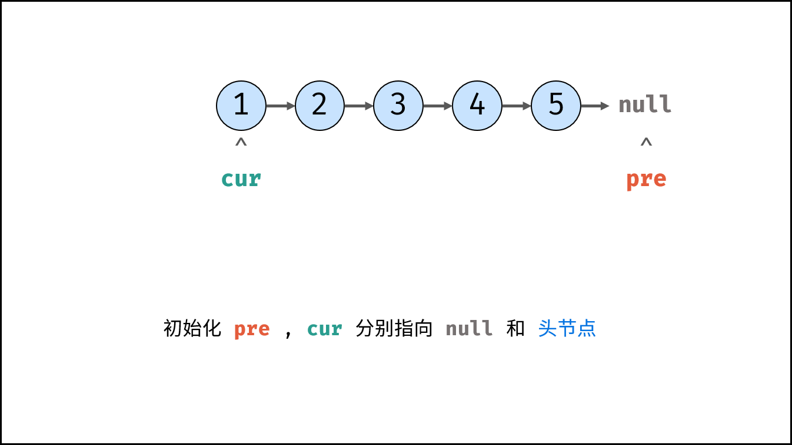
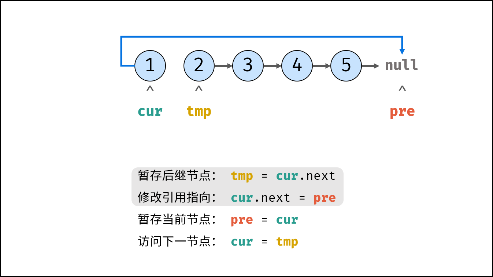
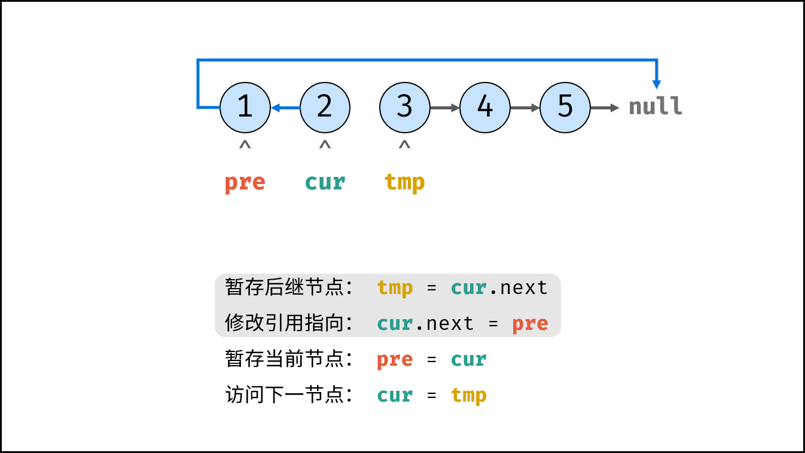

# 206. 反转链表

## Q

反转一个单链表。

示例:

```
输入: 1->2->3->4->5->NULL
输出: 5->4->3->2->1->NULL
```

进阶:
你可以迭代或递归地反转链表。你能否用两种方法解决这道题？

## Notes

### Solution1: iteration

在遍历链表时，将当前节点的 \textit{next}next 指针改为指向前一个节点。由于节点没有引用其前一个节点，因此必须事先存储其前一个节点。在更改引用之前，还需要存储后一个节点。最后返回新的头引用。







### Solution2: recursion

考虑使用递归法遍历链表，当越过尾节点后终止递归，在回溯时修改各节点的 `next` 引用指向。

#### `recur(cur, pre) `递归函数：
1. 终止条件：当`cur`为空，则返回尾节点`pre`（即反转链表的头节点）；
2. 递归后继节点，记录返回值（即反转链表的头节点）为`res`；
3. 修改当前节点`cur`引用指向前驱节点`pre`；
4. 返回反转链表的头节点`res`；

#### `reverseList(head)` 函数：

调用并返回`recur(head, null)` 。传入`null`是因为反转链表后，`head`节点指向`null`；